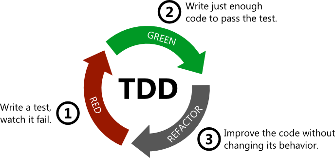

## Clase 2

## Desarrollo guiado por pruebas (TDD)


===

## Primera clase

¿Cómo les fue? ¿Pudieron ver el material? ¿Costó mucho el ejercicio?

===

## Errores comunes

--

### Mucho `forEach`

**Operaciones comunes sobre colecciones:** `map`, `filter`, `sum`, `find`, etc.

```ts
// forEach
let cantidad = 0;

for (const v in vendedores) {
  if (v.esFirme()) {
    cantidad += 1
  }
}

// count
sum(
  map(
    v => v.puntaje(), // arrow function
    vendedores // lista
  )
)
```

--

### Ojo con `toBeTruthy` sin paréntesis

```diff
- expect(vendedor.esFirme()).toBeTruthy
+ expect(vendedor.esFirme()).toBeTruthy()
```

--

### ¿Cómo testear un error?

```ts
it('falla al agregar vendedor existente', () => {
  const floresta = new CentroDistribucion()
  floresta.agregarVendedor(pepe)
  expect(
   () => floresta.agregarVendedor(pepe)
  ).toThrow('El vendedor ya existe')
});
```

--

### console.log VS error

```ts
// Log
console.log('Todo mal')
hacerAlgo()

// Error
throw new Error('Todo mal')
hacerAlgo()
```

--

### Expresiones booleanas

```ts
return cantidadFrutas >= 2 // true | false

if (cantidadFrutas >= 2) {
  return false
} else {
  return true
}
```

===

## TDD - ¿qué es?

* Práctica de diseño de software orientado a objetos (extensible a otros paradigmas).
* Metodología de trabajo.
* Aplicable en cualquier lenguaje de programación.
* Pensar primero en el uso y luego en la implementación.

--

Más detalles en el video introductorio.

===

## Reglas de oro

> Nunca escribas nueva funcionalidad sin una prueba que falle antes. (Kent Beck)

> Si no puedes escribir una prueba para lo que estás por codificar, entonces no deberías estar pensando en codificar. (Dave Chaplin)

===

## Técnica



===

# ¿Preguntas?

<div class="red-social">
  <i class="fab fa-youtube color"></i>
  <span><a href="https://youtube.com/c/elsurtambienprograma">El Sur también programa</a></span>
</div>
<div class="red-social">
  <i class="fab fa-telegram-plane color"></i>
  <span><a href="https://t.me/surprograma">@surprograma<a></span>
</div>
<div class="red-social">
  <i class="fab fa-instagram color"></i>
  <span><a href="https://instagr.am/surprograma">@surprograma<a></span>
</div>


