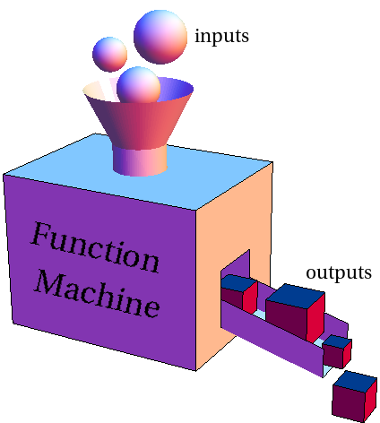

## Clase 8

## Bienvenidxs a la jungla


===

## Tareas

¿Comentarios?

--

### ¿Qué sentido tiene transformar los objetos?

- No atar nuestro diseño al de un sistema externo.
- Poder aplicar todo lo que sabemos de objetos.
- Permitir distintas serializaciones o fuentes de datos.
- Independizar dos aspectos que no tienen por qué estar vinculados.

--

### Dos opciones para resolverlo

| Adapter                                                                                                                                                                       | Transformer                                                                                                                                                              |
| ----------------------------------------------------------------------------------------------------------------------------------------------------------------------------- | ------------------------------------------------------------------------------------------------------------------------------------------------------------------------ |
|  <small style="font-size: 0.5em">Créditos: [Refactoring Gurú](https://refactoring.guru/es/design-patterns/adapter)</small> |  <small style="font-size: 0.5em">Créditos: [Math Insight](https://mathinsight.org/image/function_machine)</small> |

--

### Dos opciones para resolverlo

|                   | Adapter                                             | Transformer                           |
| ----------------- | --------------------------------------------------- | ------------------------------------- |
| _Objeto original_ | Se conserva                                         | Se pierde                             |
| _Implementación_  | Crear una subclase y volver a implementar casi todo | Solo hay que crear los objetos nuevos |

===

## Cómo probar dependencias externas

```ts
interface ClienteMail {
  enviarCorreo(asunto: String, cuerpo: String, destinatario: Email): void;
}

class AnalizadorIpsSospechosas {
  administrador: Email;

  respuestaRecibida(respuesta: Respuesta) {
    cliente.enviarCorreo(
      'Nueva respuesta sospechosa',
      this.armarCuerpo(respuesta),
      this.administrador,
    );
  }
}
```

¿Cómo pruebo que el envío de mails funciona **sin** tener que mandar un mail de verdad?

--

Puedo hacer una clase _impostora_ que registra los mails (pero no los manda):

```ts
const clienteMailTrucho: ClienteMail = {
  enviados: [],

  enviarCorreo(asunto: String, cuerpo: String, destinatario: Email): void {
    this.enviados.push({ asunto, cuerpo, destinatario });
  },
};
```

--

Y en el test, compruebo que lo que yo quería mandar está en esa lista:

```ts
it('envía mail al administrador', () => {
  analizador.respuestaRecibida(unaRespuesta);
  expect(clienteMailTrucho.enviados).toContain({
    asunto: 'Nueva respuesta sospechosa',
    cuerpo: '(200) IP 1.1.1.1 - TODO MAL - otra vez pirulo molestando',
    destinatario: 'juanadmin@gmail.com',
  });
});
```

--

Como esto es una tarea común (y bastante embolante), en general los frameworks ofrecen una solución.

Lo que se suele hacer es crear un objeto _impostor_ y luego verificar que se haya llamado a cierto método con los parámetros correspondientes:

```ts
it('envía mail al administrador', () => {
  analizador.respuestaRecibida(unaRespuesta);
  expect(clienteMailImpostor.enviarCorreo).toHaveBeenCalledWith({
    asunto: 'Nueva respuesta sospechosa',
    cuerpo: '(200) IP 1.1.1.1 - TODO MAL - otra vez pirulo molestando',
    destinatario: 'juanadmin@gmail.com',
  });
});
```

--

```ts
import { mocked } from 'ts-jest/utils';
import { consola } from './interaccion';
import programa from './programa';

// Le pedimos a Jest que "imposte" el módulo completo
jest.mock('./interaccion');

// Le "avisamos" al compilador de TypeScript que la consola es un mock
// Esto "le agrega" al objeto tenga los métodos de Jest para interactuar con mocks
const consolaMock = mocked(consola);

describe('Programa', () => {
  it('escribe una bienvenida', () => {
    programa.ejecutar();
    expect(consolaMock.escribir).toHaveBeenCalledWith('👋 ¡Hola mundo!');
  });

  it('saluda a quien lo ejecuta', () => {
    consolaMock.leer.mockReturnValue('Pepita');
    programa.ejecutar();
    expect(consolaMock.escribir).toHaveBeenCalledWith(
      '😃 Qué bueno verte por acá, Pepita.',
    );
  });
});
```

<!-- .element: class="fullscreen" -->

===

## Y ahora, ¿qué sigue?

--

### Backend

- Integración con algún ORM: TypeORM, Sequelize, Mongoose.
- Hacer una API: NestJS, ExpressJS.
- Hacer un CLI _en serio_: Commander, oclif.

--

### Frontend

- Hacer una app web: React, Vue.
- Hacer una app mobile: React Native.

===

## Actividades de la semana

 <!-- .element: class="fragment" -->

¡Terminamos! 🥳

<!-- .element: class="fragment" -->

===

# ¿Preguntas?

<div class="red-social">
  <i class="fab fa-youtube color"></i>
  <span><a href="https://youtube.com/c/elsurtambienprograma">El Sur también programa</a></span>
</div>
<div class="red-social">
  <i class="fab fa-telegram-plane color"></i>
  <span><a href="https://t.me/surprograma">@surprograma<a></span>
</div>
<div class="red-social">
  <i class="fab fa-instagram color"></i>
  <span><a href="https://instagr.am/surprograma">@surprograma<a></span>
</div>


